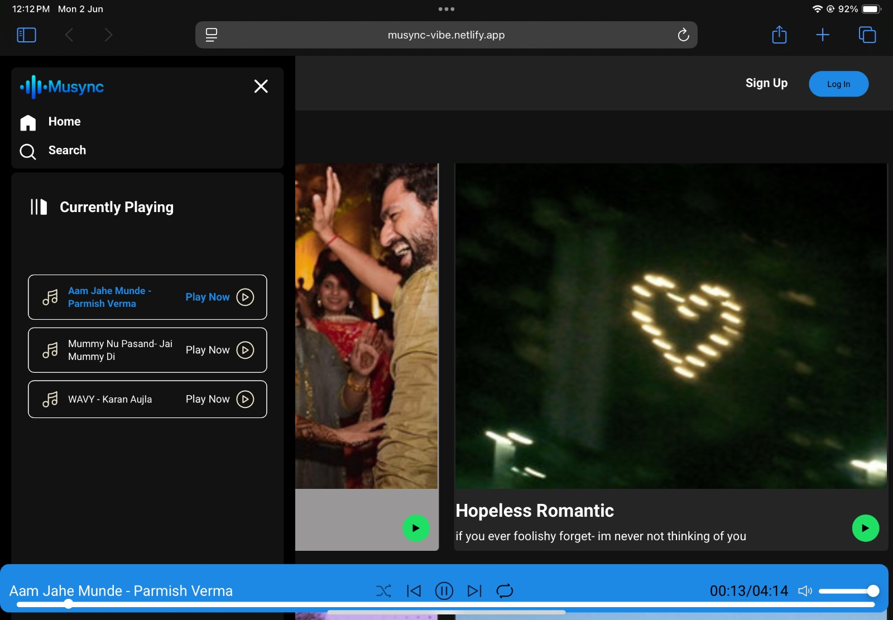

# 🎧 Musync:
Musync 🎵
A clean, fast, and fully responsive web-based music player built using HTML, CSS, and Vanilla JavaScript — featuring local MP3 playback, dynamic playlists, and full Netlify deployment compatibility.

Previews:
### Desktop View

### Mobile Home View

### Mobile Menu View

### Tablet View

# 🔥 Features:
    🎧 Local MP3 playback with custom UI

    🔁 Loop playlist / loop one

    🔀 Shuffle mode

    📱 Fully responsive design — works beautifully on mobile, tablet, and desktop

    🌐 Compatible with all major browsers: Chrome, Safari, Firefox

    🖼️ Dynamic album cards generated via albums.json and info.json

    🎚️ Seekbar + volume control with mute toggle

    ⚡ Optimized for static hosting (no backend required)

# 🛣️ Upcoming Features:
    🔐 Functional signup/login pages

    🔎 Working home & search navigation

    🌙 Dark mode toggle

    🧠 Smart mood-based playlists (AI-generated — experimental)

# 🚀 Live Demo : 👉 musync-vibe.netlify.app

# 🧠 Tech Stack:
    HTML5 + CSS3

    Vanilla JavaScript (ES6)

    JSON-based content management

    Netlify (deployment)

# 💻 Setup & Run Locally:
    git clone https://github.com/yourusername/musync.git
    cd musync
    open index.html (with Live Server or any browser)

# 📂 Folder Structure:
    /songs/
        ├── albums.json
        ├── <AlbumFolder>/
            ├── info.json
            ├── cover.jpg
            ├── song1.mp3
    /img/
    /script.js
    /index.html
    /style.css

# 🤝 Contribute:
Want to contribute? Open an issue or PR!
Features, ideas, refactors welcome ✨

# 📬 Contact:
Made with ❤️ by Aakarsh
Reach out for feedback, collabs or ideas!